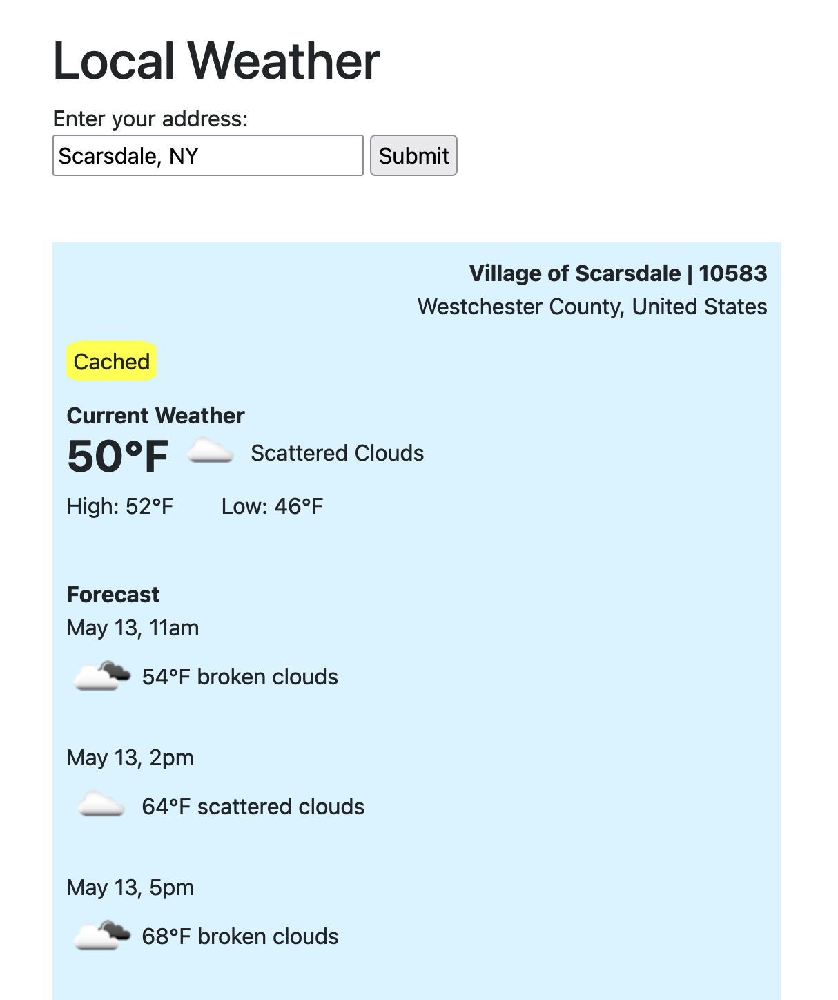

# README

## About
This is a demo of my software skills to show clean code patterns on the backend for interview purposes.

I'm using Rails 7, Hotwire & Stimulus, caching, RSpec, and a WeatherApiService that accesses OpenWeatherMap's API.

With this app, you can enter an address and get the current weather and forecast for many addresses across the world.  It will show the forecast in the forecasted time in the local timezone.  It will show the units in imperial/metric based on the country of the address you enter.

You can try an online demo of the app [here](https://weather-demo-app-8d74bfa0f23e.herokuapp.com/).

## Setup
No database is necessary.  Setup instructions are below.  Here is a screenshot of the UI:



After you clone the repo, install the gems by running this in your terminal:
```
bundle
```

You will need an API key from [OpenWeather](https://openweathermap.org/api).
Create a .env file in the root directory and add your OPEN_WEATHER_MAP_API_KEY like this:
```
OPEN_WEATHER_MAP_API_KEY=abc123
```

Run the tests by running this in your terminal:
```
rspec
```

Precompile the assets
```
rails assets:precompile
```

Turn caching on in your development environment by running this in your terminal:
```
rails dev:cache
```

Start the server
```
bin/rails server
```
